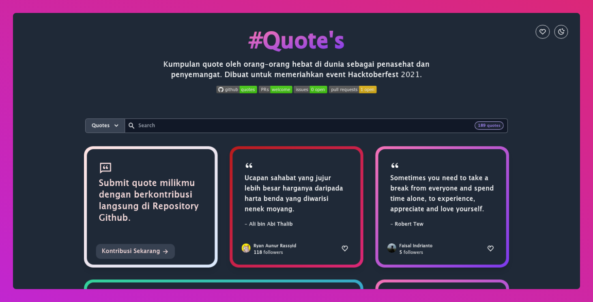

# Quote's Project


Website sederhana yang menampilkan Kutipan Inspirasional secara acak. Website ini menampilkan kutipan yang submit oleh para kontributor terbuka dan para peserta event Hacktoberfest 2021. Dapatkan kutipan yang membuatmu tetap termotivasi!

## Activities


## Screenshot

<p  align="center">

</p>

## Contribute

Kami membuka peluang untuk memeriahkan event Hacktoberfest 2021 dengan cara berkontribusi menambahkan fitur dan memperbaiki bug yang mungkin dilaporkan di-halaman issues repository ini, atau membantu kami dengan menambah quotes milikmu. 

Kamu bisa mulai berkontribusi dengan membuat quotes atau menambahkan quotes tokoh yang kamu sukai kedalam file `[your-github-username].yaml` (*nama file ini harus sesuai dengan username github kamu*) pada folder `quotes/`. Pastikan username github kamu ada dan tertulis dengan benar ya.

Untuk format filenya kita menggunakan YAML, dan pastikan format penulisannya sama ya. Setiap user hanya diperbolehkan mengubah file miliknya sendiri. Jika terdapat kesalahan penulisan pada file pengguna lain kamu bisa membantunya dengan membuatkan `issue`.

```yaml
username: nyancodeid
quotes:
  - text: 'Yang terbaik di antara kalian ialah mereka nan berakhlak paling mulia.'
    author: 'Ali bin Abi Thalib'
    author_detail_url: 'https://id.wikipedia.org/wiki/Ali_bin_Abi_Thalib'
    created_at: '3 Oktober 2021'
  - text: 'Hiduplah dengan rendah hati, tidak peduli seberapa kekayaanmu.'
    author: 'Ali bin Abi Thalib'
    author_detail_url: 'https://id.wikipedia.org/wiki/Ali_bin_Abi_Thalib'
    created_at: '3 Oktober 2021'
```

> `author_detail_url` ini adalah informasi tambahan untuk `author`. Diutamakan diambil dari website (wiki) wikipedia, linkedin, atau wiki fansbase yang tujuannya merujuk pada detail biografi lengkap dibalik author.

Catatan : Pastikan kamu hanya commit file `.yaml` saja jika tujuan kamu adalah untuk berkontribusi dalam menambah / submit quote.

## Development

Untuk memulai development kita perlu install npm package yang dibutuhkan terlebih dahulu dengan cara `npm install` atau `yarn`.

```bash
# install package dependencies
$ npm install

# generate the quotes (local development only)
$ npm run generate:quotes

# run development server
$ npm run dev
```

Agar quotes bisa digunakan/dikonsumsi oleh website, oleh karena itu kita perlu men-*generate* quotes kita menjadi satu file dengan format `JSON`. Caranya dengan menjalankan perintah `npm run generate:quotes`. Perintah ini diperlukan setiap kita mengubah file YAML kita. 

Untuk melihat versi website nya kamu bisa menjalankan perintah `npm run dev` untuk menjalankan web server dalam mode development yang berjalan pada port `localhost:3000`.
